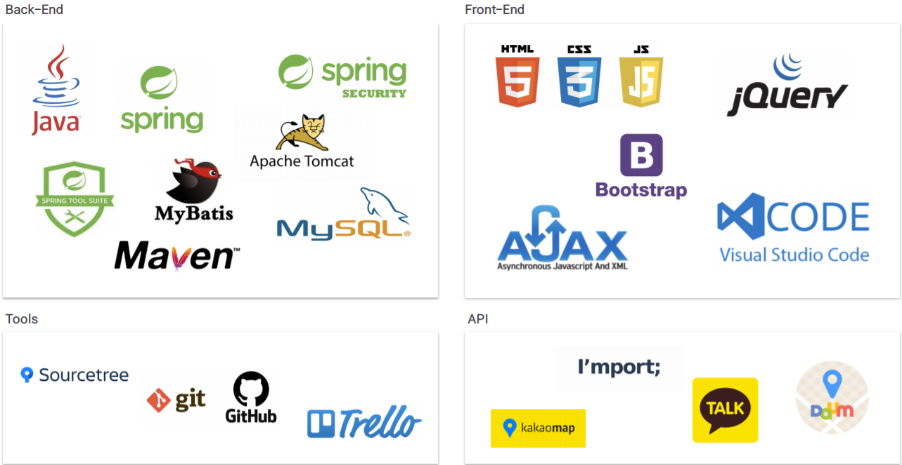

# 🏋️‍ 빌려줘! 홈짐

> COVID-19로 인해 실내 체육 시설 이용에 제한이 생기고 있습니다. 평소 운동과 건강에 관심이 많던 사람들은 맘편히 운동할 곳을 찾기 위해 가정에 홈짐을 차리거나, 프라이빗한 운동공간을 대여하고 싶은 수요가 발생하고 있는 모습을 발견했습니다. 이에 저희는 홈짐 공유 서비스 및 운동 관련 커뮤니티 플랫폼을 제공하고자 이번 프로젝트를 계획했습니다. 
 

## :calendar: 개발일정
- 2021.06.01 ~ 2021.07.12 (6주)

 

## :zap: 핵심기능

* 홈짐 호스팅: 홈짐 대여 서비스의 수요자와 공급자를 연결하는 플랫폼 제공

* 트레이너 매칭: 코로나로 인해 일자리를 잃은 트레이너에게 일자리를 구할 수 있는 플랫폼 제공

* 유저 간 채팅: 공간 공유자, 트레이너 및 일반 회원들과 소통 할 수 있는 채팅 기능 제공
 

## 💻 사용기술 / 개발환경

  

## 👉 담당역할
* 홈짐 호스팅 게시판 전체 CRUD
* AJAX와 REST API를 활용한 리뷰 및 평점 기능 CRUD
* 맵 API를 이용하여 등록된 홈짐의 위치정보 활용
* 부트스트랩을 이용하여 CSS 마무리 작업
* AWS의 ec2와 rds를 활용하여 배포
 

 

## 🏋️‍ 서비스 시연영상 & PPT

[빌려줘 홈짐 시연영상] 
[빌려줘 홈짐 전체 PPT] 
[빌려줘 홈짐 발표영상]
 

[빌려줘 홈짐 시연영상]:https://www.youtube.com/watch?v=1Xq7S1EAAXY
[빌려줘 홈짐 전체 PPT]:https://eunbi99.github.io/borrow-homegym/  
[빌려줘 홈짐 발표영상]:https://www.youtube.com/watch?v=reTxUiADxGg

